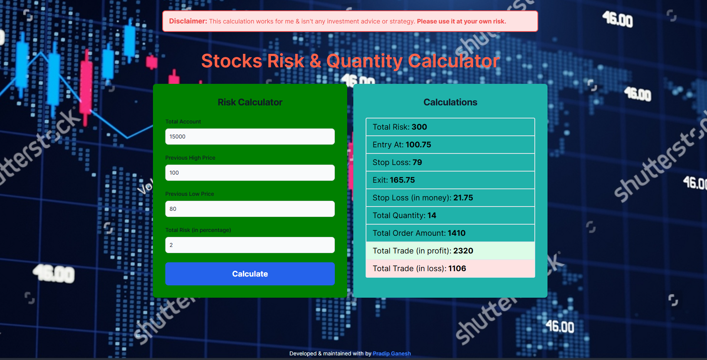

# Trading Risk Identifier

A comprehensive tool for calculating trading risks, built with Svelte. This application helps traders evaluate their risk exposure by providing detailed calculations and insights. Key features include risk percentage, position sizing, and potential profit/loss estimation.

# Features
Calculate risk percentage based on account size and risk amount
Determine position size and potential profit/loss
User-friendly interface for quick and easy calculations

# Technologies Used
Svelte: A framework for building high-performance user interfaces
JavaScript: Core scripting language for logic and interactivity
CSS: Styling for a clean and responsive design

